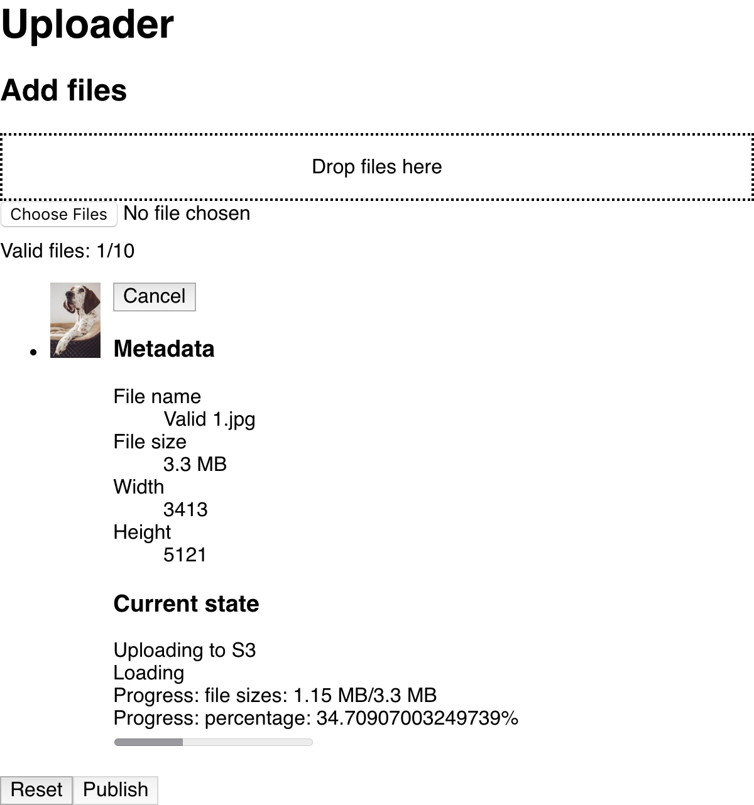

# unsplash-uploader-prototype

https://unsplash.github.io/uploader-prototype/

[Read the blog post](https://medium.com/unsplash/building-the-unsplash-uploader-880a5ba0d442).



## Development

```sh
yarn
npm run compile:watch
npm run start:server
open http://localhost:8080
# OR
open http://localhost:8080/?should_render_demos
```
